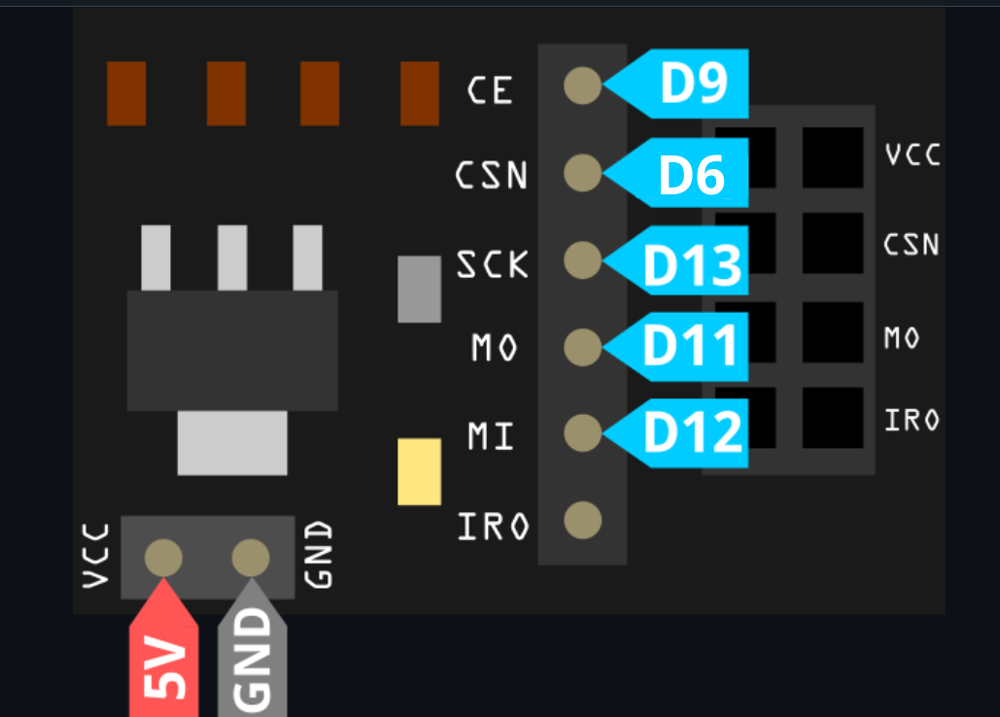
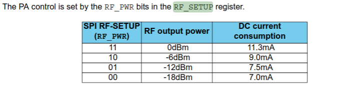

## pinout

```
CLK     D13
MOSI    D11
MISO    D12
CS      D6
CE      D9

```



#### Попробуем записать данные в регистр и считать данные из регистра
**Запись 0x4F в регистр SETUP_RETR:**
 


**Чтение данных из регистра SETUP_RETR:**


Видно, что регистр вернул нам 0x4F - то, что было записано


#### Сконфигурируем мощность радиомодуля
в документации сказано 




Значит, мощности записываются в регистр RF_PWR в биты 2:1
```
11 - MAX
10 - HIGH
01 - LOW
00 - MIN

```
попробуем записать мощность  HIGH
**читаем регистр RF_SETUP:**


попробуем записать мощность  LOW
**читаем регистр RF_SETUP:**


