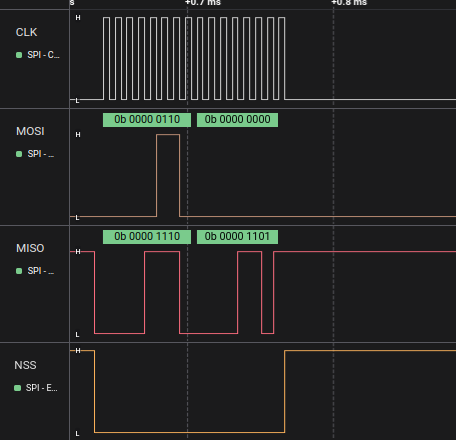
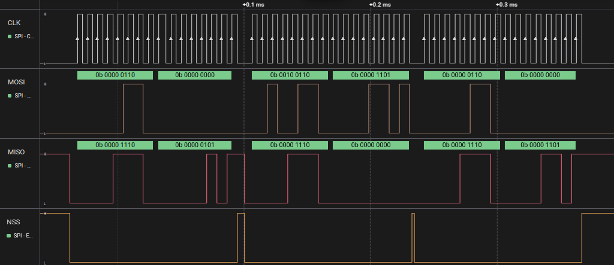
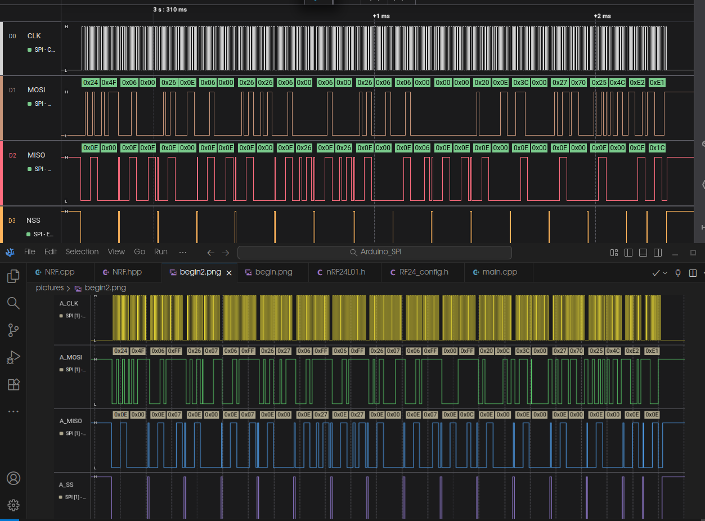

# переписываем библиотеку(GyverNRF) c Arduino нас STM32
## write_register()
**- на Arduino:**

**- на STM32_103:**

## read_register()

**- на Arduino:**

**- на STM32_103:**

Видно, что второе значение по MOSI из Arduino и из STM103 не совпадают, но это неважно, так как оно послылается, чтобы считать значение из регистра радиомодуля. А оно, как можно видеть для Arduino и для STM103 одинаковое (0x4F).

## setPALevel()

**- на Arduino:**

**- на STM32_103:**

функция записывает мощность в регистр. Подробнее читай в README в папке ARDUINO_SPI

## setDataRate()
подаём RF24_2MBPS

**- на Arduino:**

**- на STM32_103:**

## begin()
сравнение: вверху - STM_103, внизу - Arduino

Некоторые значения могут отличаться, так как я использую два модуля сразу - один подключен к стм другой к акдуино. И в некоторых  регистов, модуля с стм некотрые биты уже включены в 1. Поэтому значения немного отличаются, тут чтобы проверить корректность. нужно смотреть не по байту, а по битам в регитсре.

Кстати, немного пояснений. Передача происходит парами: сначала номер регистра, затем его значение.
если мы видим когда хотим записать данные в регистр, к его адресу прибавляется 0x20, когда прочитать, то 0x00, то есть ничего.